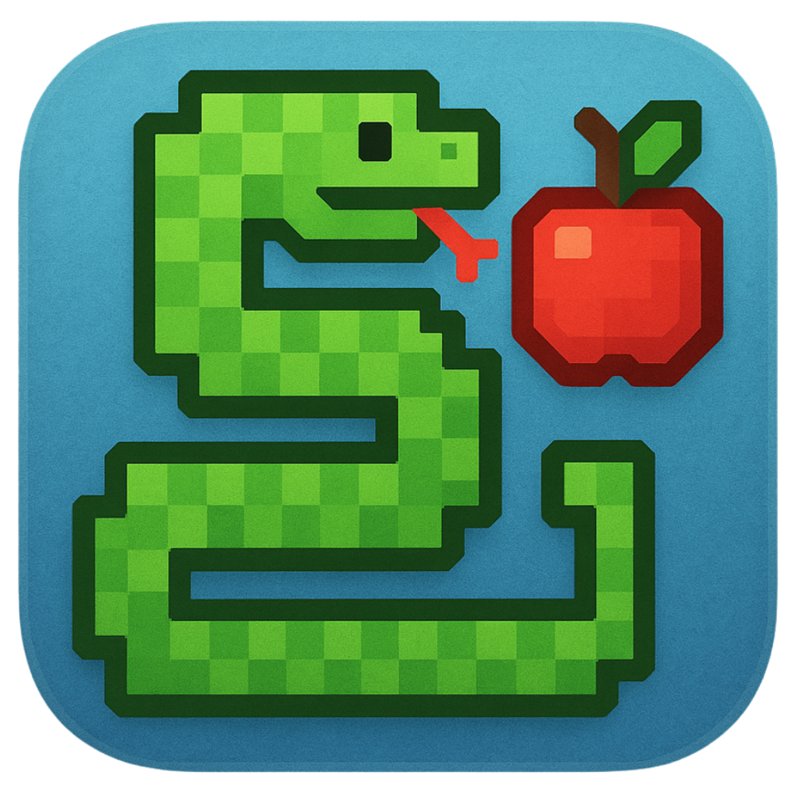

<p align="center">
  
</p>

# 貪吃蛇遊戲

一款使用 Python 製作的復古風格貪吃蛇遊戲，特色如下：

- 多種遊戲模式：單人模式、雙人對戰、玩家對電腦
- 多種不同效果的食物
- 使用像素字體與 8-bit 音效，打造懷舊風格

## 遊戲特色

- **遊戲模式**：
  - 單人模式：經典貪吃蛇玩法
  - 雙人對戰：本地雙人同屏遊玩
  - 玩家對電腦：與 AI 電腦對手競爭

- **食物種類**：
  - 蘋果（+1 分）
  - 金蘋果（+5 分）
  - 毒藥（-3 分並使蛇身縮短）

- **視覺效果**：
  - 流暢動畫
  - 漸層色蛇身
  - 像素風格字體（Cubic 11）
  - Minecraft 風格物品圖示

- **音效系統**：
  - 吃食物音效
  - 遊戲結束音效
  - 選單操作音效

## 系統需求

- Python 3.7 或以上版本
- 需要安裝 `pygame` 模組

安裝方式：
```bash
pip install pygame
```

## 執行方式

```bash
python main.py
```

## 檔案架構

```
Snake-main/
├── main.py
├── game.py
├── objects.py
├── settings.py
├── assets/
│   ├── fonts/
│   │   └── Cubic_11.ttf
│   ├── images/
│   │   ├── icon.png
│   │   └── food/
│   │       ├── Apple.png
│   │       ├── GoldenApple.png
│   │       └── Poison.png
│   └── sounds/
│       ├── eating.mp3
│       ├── gameover.mp3
│       └── select.mp3
├── LICENSE
└── README.md
```

## 授權

本專案採用 MIT License 授權，詳情請參閱 `LICENSE` 檔案。
